# 2025年最值得推荐的15款免费网站建站工具

创建一个专业网站曾经需要雇佣设计师和开发人员,花费数周时间和数千美元成本。现代建站工具通过拖拽式编辑器、AI辅助设计和现成模板库,让非技术背景的创业者也能在几小时内搭建出响应式网站。无论是电商店铺、作品集展示还是企业官网,选择合适的建站平台直接影响网站加载速度、搜索引擎可见性和后续维护成本。本文精选15款经过市场验证的免费或低成本建站工具,涵盖从个人博客到企业级应用的多样化场景,帮助您快速找到最匹配业务需求的建站解决方案。

***

## **[SITE123](https://www.site123.com)**

零技术门槛的极简建站方案,真正免费无隐藏费用

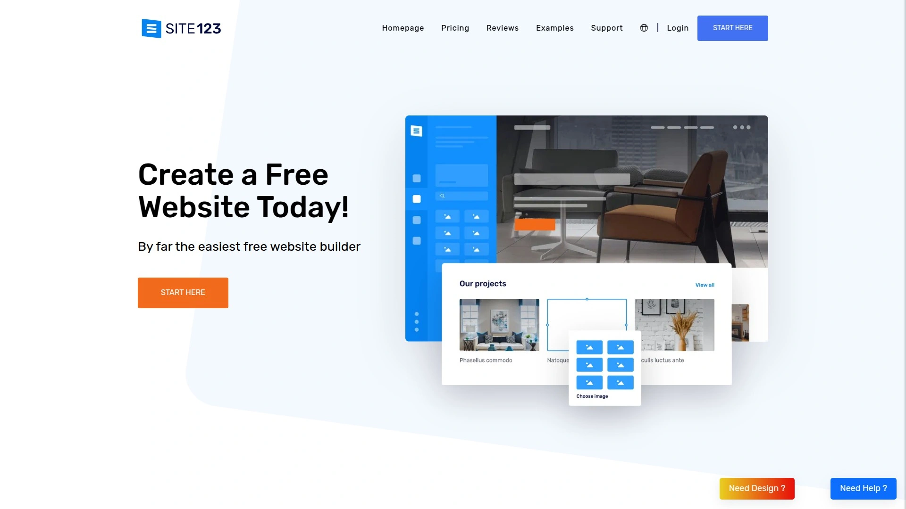

SITE123自称"市场上最简单快速的免费建站工具",其核心理念是消除拖拽操作的复杂性,用户只需上传内容即可自动生成跨平台适配的完整网站。平台提供完全免费的套餐,包含托管服务和网页编辑器的全部工具,无需支付、无试用期限制、无强制承诺。

**一键式设计系统**:SITE123预设多种样式和布局模板,用户为每个页面选择合适的设计方案后即可上线,所有样式可随时更换。自动响应式调整确保网站在智能手机和平板电脑上完美显示,无需额外配置。集成图片库包含数百张高质量免费图片,解决素材采购难题。

免费版提供自定义子域名(例如yourname.site123.com),付费升级至自定义域名仅需$10.8/月(年付)或$17/月(三月付)。SITE123特别强调SEO友好性,确保网站能被Google等搜索引擎完整索引,这是免费建站工具中的重要优势。单个账户可创建和管理多个网站,适合需要运营多个项目的创业者。

**全球CDN加速**:网站内容存储在分布全球的内容分发网络服务器上,访客将从最近的服务器节点加载页面,显著缩短加载时间。100%满意度保证和无限电话邮件支持降低试错成本。SITE123特别适合预算紧张的初创企业、个人作品集展示和快速验证商业想法的MVP场景。

***

## **[Wix](https://www.wix.com)**

全球市场份额第一的拖拽式建站平台,2亿用户验证

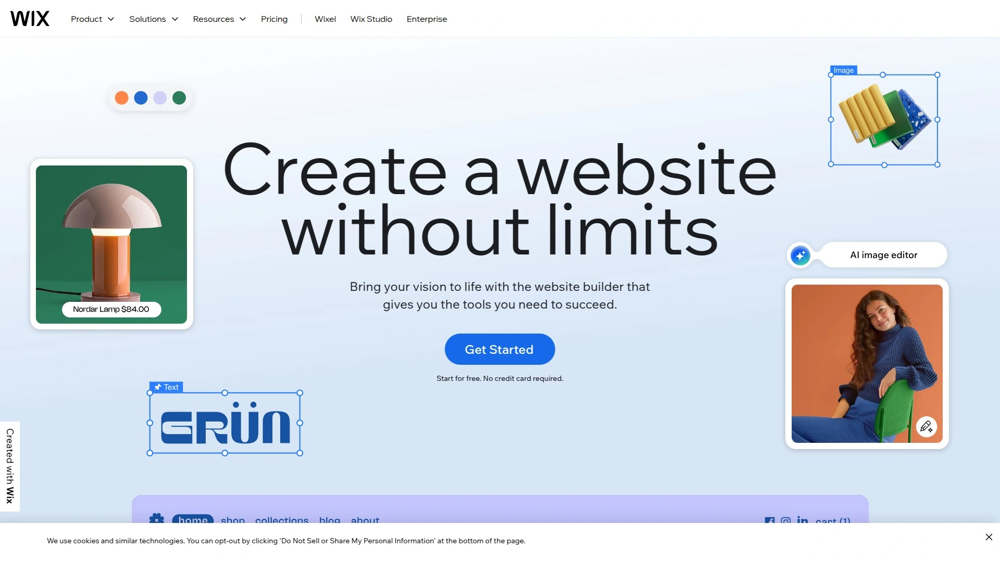

Wix占据"简单建站工具"市场45%份额,几乎是第二名Squarespace的三倍,全球超过2亿人使用其工具创建网站。平台的核心竞争力是直观的拖拽编辑器,初学者、自由职业者和企业都能快速上手,无需编程或设计技能。

Wix提供免费套餐包含基础功能和Wix品牌子域名,付费Premium套餐解锁自定义域名、移除广告、增加存储空间和带宽。人工智能工具Wix ADI(人工设计智能)可根据用户回答的几个问题自动生成定制网站,进一步降低建站门槛。应用市场提供数百个扩展插件,涵盖预约系统、在线支付、会员管理和营销自动化等功能。

**模板生态系统**:800多个专业设计的模板覆盖各行各业,从餐厅、健身房到在线课程和音乐人作品集。每个模板都完全可定制,包括字体、颜色、布局和组件。Wix Editor X为高级用户提供响应式设计的精细控制,适合需要像素级调整的专业设计师。

Wix SEO向导引导用户完成搜索引擎优化的关键步骤,包括元标签设置、结构化数据和站点地图生成。集成分析仪表板追踪访客行为、流量来源和转化漏斗。Wix特别适合重视视觉呈现的创意行业、需要丰富扩展功能的中小企业、以及希望从免费方案逐步升级的初学者。

***

## **[Weebly](https://www.weebly.com)**

Square生态系统加持,电商与支付深度整合

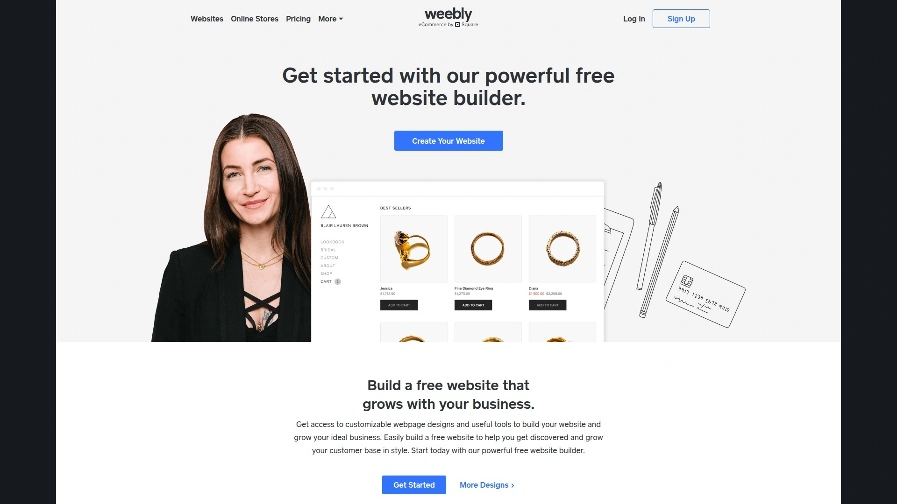

Weebly现隶属于Square支付公司,为小企业主提供网站和电商建站工具,其120天Cookie追踪时长在行业中表现突出。平台强调用户友好性和可负担性,多语言支持使其成为国际化业务的理想选择。

Weebly的拖拽编辑器允许用户通过简单的点击和拖动来添加文本、图片、视频、表单和电商功能模块。免费套餐包含基础建站工具和Weebly子域名,付费计划从$10/月起解锁更多功能。与Square支付系统的原生集成让用户能在线上商店和线下实体店使用统一的支付解决方案,支持客户偏好的任何支付方式。

**电商特色功能**:库存管理、订单追踪、运费计算、优惠券系统和客户账户管理一应俱全。移动应用允许商家在手机上管理网站和处理订单,实现随时随地的业务运营。SEO工具包括自定义URL、元描述编辑和alt标签设置。

Weebly特别适合需要简单电商功能的小型零售商、实体店希望拓展在线渠道的商家、以及偏好一体化支付解决方案的创业者。其学习曲线平缓,即使完全没有建站经验的用户也能在一天内完成网站搭建。

***

## **[Squarespace](https://www.squarespace.com)**

设计师首选的高端模板平台,视觉美学标杆

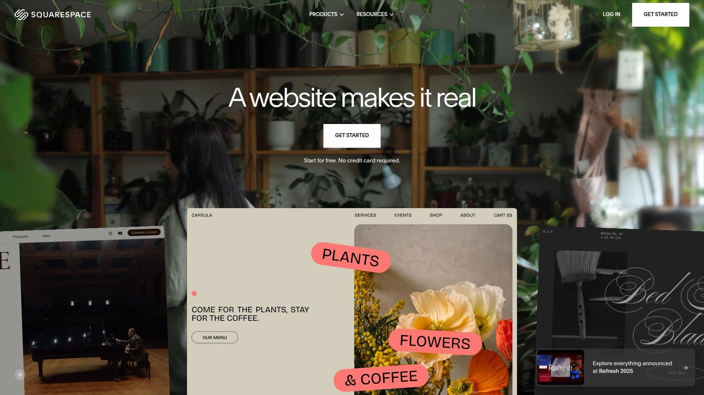

Squarespace以精美的设计模板和强大的视觉工具著称,特别受摄影师、艺术家和设计导向型企业青睐。每个模板都由专业设计师打造,遵循现代设计原则和最新视觉趋势。

平台采用块式编辑系统,用户通过添加和排列内容块来构建页面,既保持设计一致性又提供灵活性。内置的图片编辑功能包括裁剪、滤镜和焦点调整,无需使用第三方图片编辑软件。Squarespace Commerce提供完整的电商解决方案,支持实体产品、数字下载、服务预约和会员订阅。

**营销工具集成**:邮件营销模块直接在平台内创建和发送通讯,自动同步网站访客和客户数据。社交媒体集成允许一键分享内容到Instagram、Facebook和Pinterest,并可将社交平台内容反向同步到网站。分析仪表板提供实时流量数据、销售报告和客户洞察。

Squarespace定价从$16/月的个人计划到$49/月的高级电商计划,所有计划均包含免费自定义域名(年付)。14天免费试用期允许用户充分体验平台能力后再决定付费。Squarespace特别适合重视品牌形象的创意专业人士、需要作品集展示的艺术家、以及追求设计品质的精品店主。

---

## **[Shopify](https://www.shopify.com)**

全球领先的电商建站平台,从创业到上市的完整支持

Shopify是专门为在线销售而设计的建站工具,支持从单人创业到大型企业的各种规模电商业务。平台处理超过数百万商家的交易,生态系统包含8000多个应用、数千个模板和全球开发者社区。

**AI驱动的快速建站**:Shopify AI工具能在几分钟内根据业务描述生成完整网站,包括产品页面、关于我们、政策条款等内容。预设模板涵盖时尚、家居、电子产品、美容等各垂直领域,所有模板均移动优先设计。

核心电商功能包括无限产品上传、库存管理、多渠道销售(网站、社交媒体、市场平台)、弃购恢复和折扣码系统。Shopify Payments消除第三方支付网关手续费,支持全球135种货币和本地支付方式。一键购买和快速结账功能优化转化率,平均提升35%的成交率。

应用商店提供从邮件营销、客户评价、忠诚度计划到高级分析和库存预测的所有功能扩展。Shopify Fulfillment Network和第三方物流集成简化订单履行流程。定价从$29/月的Basic计划到$299/月的Advanced计划,所有计划包含3天免费试用。

Shopify特别适合认真对待在线销售的商家、计划快速扩展的成长型电商、以及需要全球销售能力的跨境卖家。其强大的生态系统和持续创新能力确保企业能随着业务增长不断解锁新功能。

***

## **[Webflow](https://www.webflow.com)**

专业开发者级可视化设计工具,代码级控制无需编程

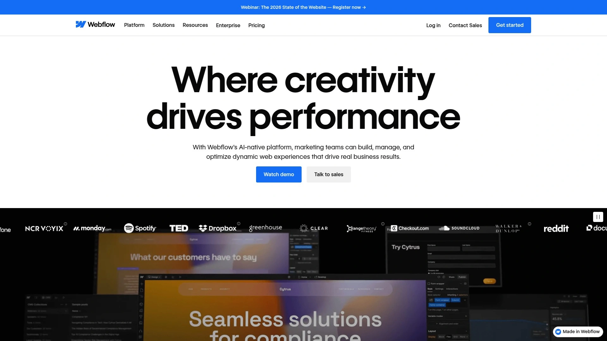

Webflow将专业web开发的精细控制与可视化编辑器的便捷性相结合,让设计师能创建复杂的响应式网站而无需编写代码。平台在设计自由度和技术能力上超越传统拖拽工具,适合对网站性能和设计细节有高要求的用户。

**可视化开发环境**:Webflow Designer模拟真实的CSS盒模型和Flexbox/Grid布局系统,设计师的每个操作都转化为干净的HTML、CSS和JavaScript代码。动画和交互编辑器支持创建复杂的滚动触发效果、鼠标悬停状态和页面转换动画,无需安装插件。

内置CMS(内容管理系统)允许构建动态内容驱动的网站,如博客、案例研究库和产品目录,编辑可通过简洁的后台管理内容而无需接触设计。Webflow Ecommerce提供完整的在线商店功能,包括购物车、结账流程和订单管理。

全球CDN托管确保快速加载速度,自动SSL证书保护网站安全。SEO控制包括自定义元标签、Open Graph设置、结构化数据和XML站点地图。Webflow University提供数百个免费视频教程,覆盖从基础到高级的所有主题。

定价从免费的Starter计划(限2个项目)到$42/月的CMS计划,电商计划从$29/月起。Webflow特别适合专业设计师和机构、需要定制化设计的品牌、以及希望学习现代web开发的创意人士。

***

## **[Duda](https://www.duda.co)**

机构和白标方案专家,多客户管理优化

Duda专为网页设计机构、SaaS平台和数字营销机构打造,提供白标建站解决方案和批量客户管理能力。平台允许机构以自己的品牌向客户提供建站服务,同时享受Duda的技术基础设施和支持。

**机构级功能集**:团队协作工具支持多个设计师同时编辑网站,权限管理系统精细控制客户访问级别。客户管理仪表板集中展示所有项目的状态、续费日期和性能指标。批量编辑功能允许一次性更新多个站点的共同元素,大幅提升维护效率。

Duda编辑器采用行和列的结构化布局系统,响应式设计工具提供桌面、平板和移动端的独立控制。动态页面功能通过数据库驱动内容生成,适合创建位置页面、团队成员目录和产品列表。电商功能支持在线销售,集成多种支付网关。

性能优化工具包括自动图片压缩、延迟加载和代码精简,确保网站快速加载。多语言支持和本地化工具帮助机构服务国际客户。定价采用机构套餐模式,根据管理的网站数量和功能需求定制。

Duda特别适合管理多个客户项目的网页设计机构、提供白标建站服务的SaaS公司、以及需要规模化网站部署的企业。其专注于B2B场景的功能设计使其在机构市场中独树一帜。

***

## **[GoDaddy](https://www.godaddy.com)**

一站式在线业务中心,域名托管建站全包

GoDaddy从全球最大的域名注册商扩展为综合在线业务平台,提供域名、托管、建站工具、邮件和营销服务的一站式解决方案。这种整合模式让用户无需在多个供应商间协调服务,简化技术管理复杂度。

建站工具采用AI辅助设计系统,用户回答关于业务的几个问题后即可获得完整网站初稿。编辑器提供行业特定模板和内容建议,加速建站流程。GoDaddy InSight功能分析用户业务并提供个性化的增长建议,包括SEO优化、社交媒体策略和广告投放。

**营销工具生态**:邮件营销模块支持创建专业通讯并追踪打开率和点击率。社交媒体管理工具允许从单一界面发布内容到多个平台。预约系统和在线支付功能适合服务型企业,客户可直接在网站预约并付款。

域名和托管服务与建站工具深度集成,一键连接无需技术配置。24/7电话支持和在线聊天提供即时帮助。定价从基础建站套餐到高级电商方案,经常提供首年折扣优惠。

GoDaddy特别适合希望简化技术管理的小企业主、需要域名和建站一站式服务的创业者、以及重视客户支持可用性的非技术用户。其品牌知名度和广泛的服务组合降低了新手的决策负担。

***

## **[Hostinger](https://www.hostinger.com)**

高性价比托管与建站组合,新手友好型设计

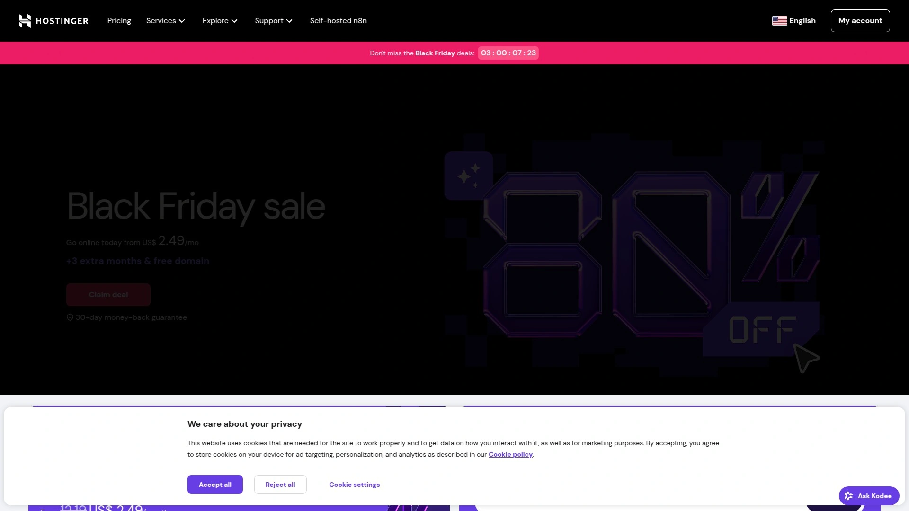

Hostinger以极具竞争力的价格提供网站托管和建站工具,特别适合预算敏感的用户。平台简化了从域名购买到网站上线的整个流程,拖拽式建站工具和应用安装器降低技术门槛。

**托管优势**:Hostinger的托管基础设施采用LiteSpeed服务器和内置缓存技术,确保网站快速加载。免费SSL证书、每日备份和恶意软件扫描保护网站安全。99.9%正常运行时间保证和全球数据中心网络确保可靠性。

网站建站工具提供超过100个预设计模板,覆盖商业、创意、科技等各类场景。AI辅助功能加速内容创建和设计选择。WordPress一键安装和自动更新让用户能轻松使用世界上最流行的CMS系统。

Hostinger hPanel控制面板简化托管管理,初学者能快速找到所需功能。24/7实时聊天支持提供多语言帮助。定价从$2.99/月起的共享托管到VPS和云托管方案,所有计划包含30天退款保证。

Hostinger特别适合寻求极致性价比的个人博主、需要可靠托管的小型企业、以及希望使用WordPress但不想处理技术细节的用户。其透明定价和慷慨的资源配额在入门级托管市场中极具竞争力。

***

## **[Zyro](https://www.zyro.com)**

AI创意工具集成,内容生成自动化

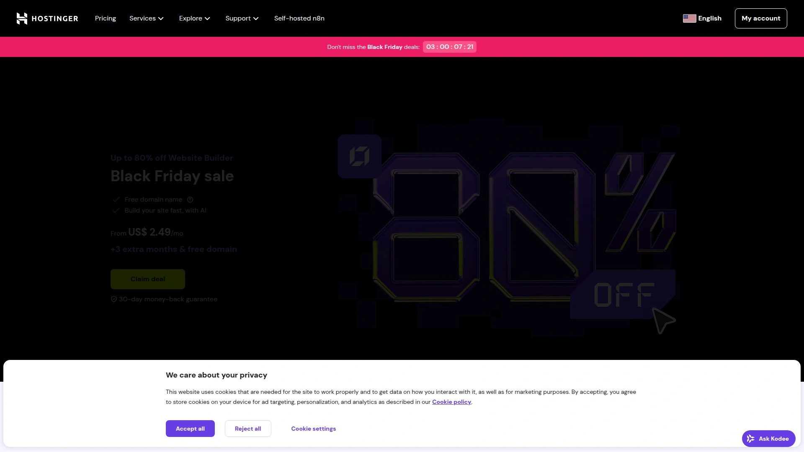

Zyro将人工智能深度整合到建站流程中,提供AI写作助手、AI图片放大器和AI热图预测等创新功能。这些工具帮助用户快速生成内容、优化图片质量和预测访客注意力焦点,显著加速网站创建过程。

AI写作助手能根据关键词生成营销文案、产品描述和博客文章,解决内容创作瓶颈。AI Slogan生成器和Business Name生成器帮助创业者快速完成品牌命名。AI热图分析预测访客最可能点击网站的哪些区域,指导设计优化决策。

**模板与编辑器**:Zyro提供数百个现代化模板,所有模板针对移动端优化并支持完全定制。拖拽编辑器简单直观,无需学习即可上手。电商功能包括产品管理、库存追踪、支付集成和订单处理。

定价极具竞争力,基础计划从$2.90/月起(促销期),包含免费域名、托管和SSL证书。30天退款保证降低试错成本。Zyro特别适合需要快速生成内容的创业者、重视AI辅助设计的创意人士、以及预算有限但希望获得现代化网站的小企业。

***

## **[Ucraft](https://www.ucraft.com)**

免费SSL和无限带宽,无隐藏限制承诺

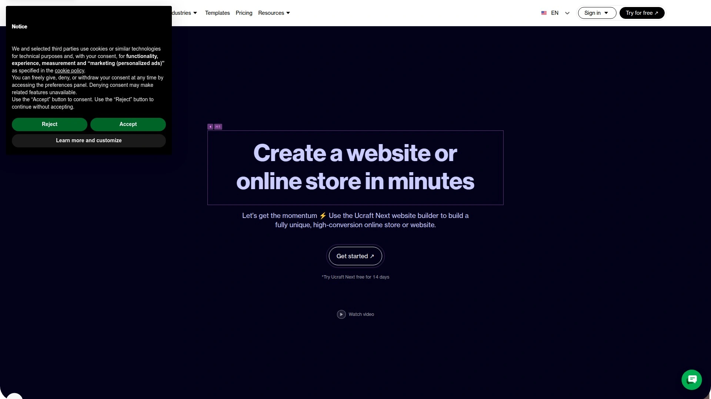

Ucraft强调透明定价和慷慨的资源配额,免费计划提供真正的无限带宽和页面数量,不像某些竞争对手设置隐形限制。平台专注简化建站流程,让用户能在几小时内创建专业网站。

拖拽编辑器提供灵活的设计控制,用户可精确定位元素和调整样式。模板库覆盖企业、作品集、登陆页和在线商店等多种类型。Logo设计工具允许用户在平台内创建品牌标识,无需使用第三方软件。

**电商与落地页**:Ucraft的电商功能支持产品销售、库存管理和订单处理,集成Stripe和PayPal支付网关。登陆页创建工具专为营销活动优化,内置表单构建器收集潜在客户信息。多语言支持和字体自定义满足国际化和品牌一致性需求。

定价从免费计划到Pro和Pro+套餐,付费计划解锁自定义域名、移除Ucraft品牌和高级电商功能。14天免费试用允许体验所有高级功能。Ucraft特别适合需要真正免费方案的预算用户、创建单页面登陆页的营销人员、以及小型电商卖家。

***

## **[TemplateMonster](https://www.templatemonster.com)**

海量模板市场,专业设计资源库

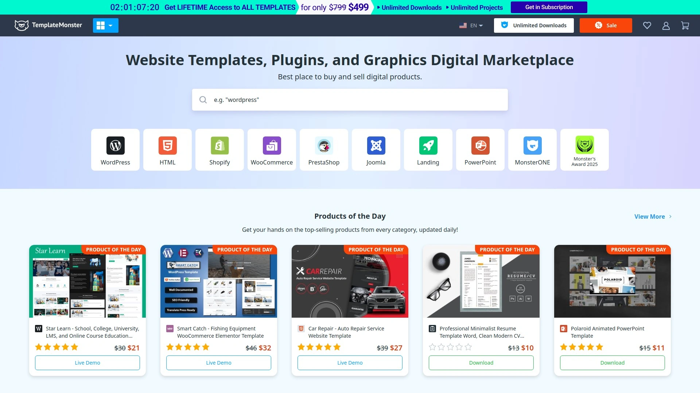

TemplateMonster是全球领先的数字产品市场,提供超过30000个网站模板、主题和图形设计资源。平台不仅销售模板,还提供安装服务、定制开发和技术支持,为不同技术水平的用户提供完整解决方案。

**模板生态丰富性**:涵盖WordPress、Shopify、Joomla、Magento、PrestaShop等所有主流CMS和电商平台的模板。每个模板都包含详细的文档、演示内容和视频教程,降低使用门槛。响应式设计确保在所有设备上完美显示。

MonsterONE订阅服务提供无限下载访问权限,单一月费即可使用平台上所有模板、插件、字体和图形资源。这种模式特别适合机构和自由职业者需要频繁启动新项目的场景。技术支持团队提供安装协助和问题排查。

TemplateMonster还运营Zemez建站工具,提供在线编辑器和托管服务,用户无需安装CMS即可使用模板。定制开发服务满足需要独特设计的客户。TemplateMonster特别适合寻找特定行业模板的用户、需要大量设计资源的机构、以及希望基于成熟主题快速启动项目的开发者。

***

## **[Carrd](https://carrd.co)**

单页面网站专家,极简主义设计哲学

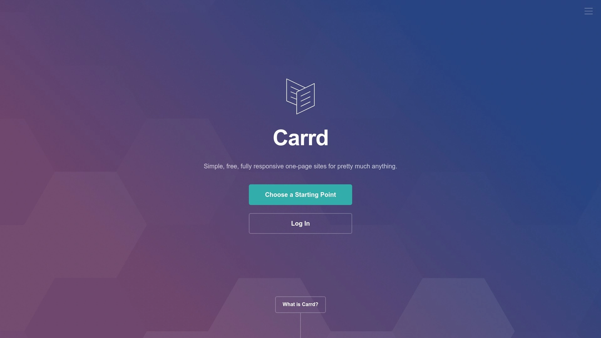

Carrd专注于创建简单、响应式的单页面网站,适合个人简介、落地页、作品集和活动页面等场景。平台的极简设计理念和极低的价格点使其在特定细分市场中极受欢迎。

**单页面优化**:Carrd提供超过50个预设计的起始模板,所有模板针对单页面叙事优化。编辑器简单直观,提供文本、图片、视频、表单、按钮和嵌入等基本元素。滚动触发动画和视差效果增加视觉趣味性。

免费计划允许创建最多3个网站,Pro计划仅需$19/年解锁无限网站、自定义域名、表单提交通知和高级元素。Pro Plus和Pro Business计划增加更多站点和高级功能。Carrd的定价是市场上最实惠的选择之一。

自定义代码注入允许高级用户添加JavaScript和CSS进行深度定制。表单集成支持Mailchimp、Google Sheets和Zapier,收集的数据可自动同步到其他工具。Carrd特别适合需要快速创建落地页的营销人员、展示单一项目或活动的组织者、以及重视加载速度和简洁性的个人用户。

---

## **[Dorik](https://dorik.com)**

无代码网站与登陆页构建器,模板即用即走

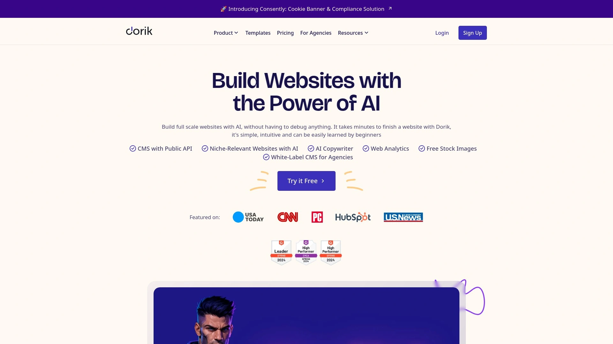

Dorik将无代码网站创建推向新高度,提供丰富的预制UI组件和模板,用户通过简单的拖拽和配置即可创建专业网站。平台特别强调登陆页创建的便捷性,帮助营销人员快速测试不同的消息和设计。

**模板与组件库**:Dorik提供超过80个预设计的UI块(如页眉、英雄区、特性展示、定价表、页脚等),用户混搭组合这些块快速组装页面。完整网站模板覆盖创业公司、SaaS、机构、作品集等多种场景。所有模板和组件完全响应式且支持定制。

CMS功能允许创建博客和动态内容页面,支持SEO优化和社交媒体分享。白标选项让机构能以自己的品牌向客户提供建站服务。自定义域名连接、SSL证书和全球CDN托管包含在付费计划中。

定价从免费计划到$18/月的个人计划和$39/月的专业计划。Dorik特别适合需要快速创建多个登陆页的营销团队、寻求Webflow简化替代方案的设计师、以及重视构建速度的创业公司。平台在易用性和设计灵活性之间取得良好平衡。

***

## **[Strikingly](https://www.strikingly.com)**

移动优先时代的单页建站工具,亚洲市场领导者

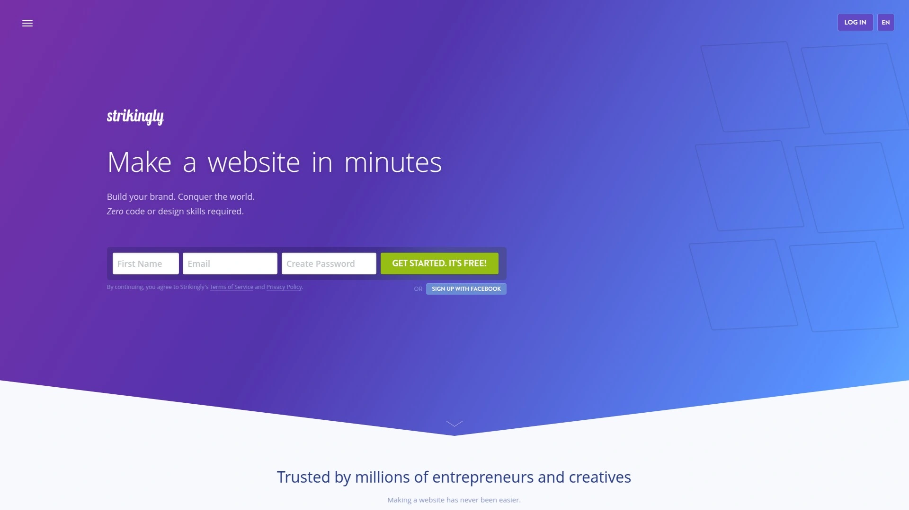

Strikingly专注于移动优先的单页面网站创建,特别在亚洲市场拥有强大的用户基础。平台理念是现代用户主要通过移动设备浏览网站,因此移动体验应该是设计的首要考虑。

简单的编辑器允许用户在几分钟内创建个人网站、作品集或小型企业站点。预设模板针对移动浏览优化,确保在小屏幕上的可读性和交互性。内置博客功能支持内容发布和SEO优化。

**电商与会员功能**:Strikingly支持简单商店和产品销售,集成支付网关处理交易。会员系统允许创建受密码保护的内容区域,适合在线课程和付费内容。简单商店功能适合销售少量产品的个人创业者。

免费计划提供基础功能和Strikingly子域名,Pro计划从$8/月起解锁自定义域名和移除品牌。多语言支持包括简体中文界面,降低非英语用户的使用障碍。Strikingly特别适合个人品牌建设、自由职业者作品集展示、以及亚洲市场的小企业快速上线。

***

## **[WordPress.com](https://wordpress.com)**

开源CMS巨头的托管版本,无限扩展潜力

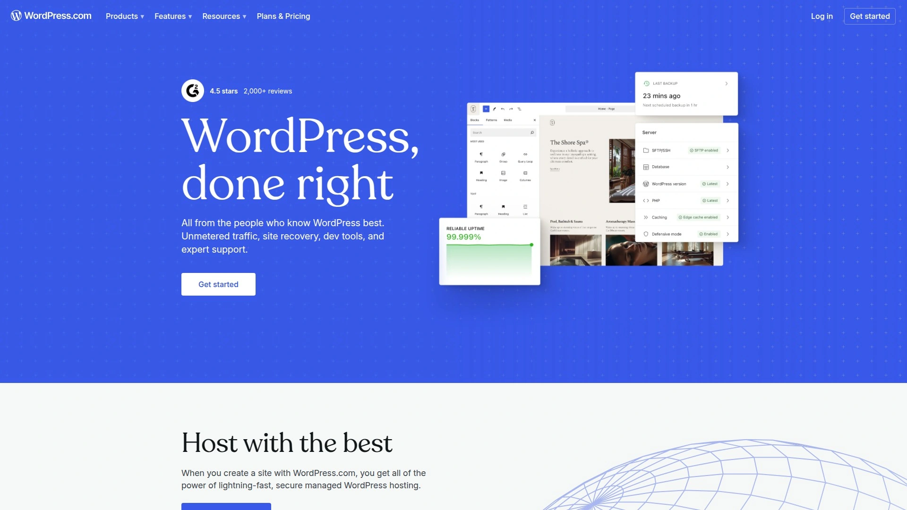

WordPress.com是Automattic公司提供的WordPress托管服务,区别于需要自行安装的WordPress.org。这种托管版本消除了服务器配置、软件更新和安全维护的技术负担,让用户专注内容创作。

**WordPress生态系统优势**:作为全球43%网站使用的CMS系统,WordPress拥有无与伦比的插件和主题生态。WordPress.com提供访问数千个免费和付费主题的权限。Gutenberg块编辑器提供灵活的内容创建方式,数百种块类型支持复杂的页面布局。

免费计划包含基础博客功能和WordPress.com子域名,付费计划从$4/月的个人计划到$45/月的电商计划。商业和电商计划解锁插件安装能力,用户可添加任何WordPress插件扩展功能。WooCommerce集成提供强大的电商能力。

Jetpack安全套件提供恶意软件扫描、备份和垃圾评论防护。WordPress.com特别适合认真对待博客和内容营销的用户、需要SEO优化能力的企业、以及计划未来扩展到复杂功能的长期项目。其庞大的开发者社区确保任何问题都能找到解决方案。

***

## 常见问题

**如何选择免费建站工具还是付费升级方案?**

免费计划通常包含平台品牌子域名、有限存储空间和平台广告,适合测试想法或创建临时页面。付费升级主要解锁自定义域名连接(提升品牌专业度)、移除平台广告、增加存储和带宽配额、以及高级功能如电商、会员系统和优先支持。如果网站用于正式商业用途或需要长期运营,建议至少选择$10-15/月的基础付费计划以获得自定义域名和更好的性能。评估时需考虑您的品牌形象需求、预期流量规模和必需功能清单。

**建站工具的SEO优化能力差异体现在哪些方面?**

现代建站工具普遍支持基础SEO功能如自定义元标题、描述和URL结构。但高级平台在技术SEO上表现更优,包括自动生成结构化数据标记、XML站点地图、移动优先索引优化和快速加载速度。Wix和Squarespace提供SEO向导引导用户完成优化步骤,WordPress.com凭借庞大的SEO插件生态(如Yoast SEO)提供最深度的控制。Webflow和SITE123强调代码清洁度和CDN加速,这些技术因素直接影响搜索引擎排名。如果SEO是核心优先级,建议选择提供完整技术控制和高性能托管的平台。

**哪些建站平台更适合后期业务扩展?**

Shopify和WordPress.com在可扩展性上表现最优,前者通过8000多个应用支持从小店到大型电商的增长路径,后者通过插件生态几乎可实现任何功能扩展。Webflow和Duda适合需要定制化设计和高级功能的成长型企业,前者提供开发者级控制,后者优化机构批量管理场景。相比之下,Carrd和Strikingly等单页面专用工具在复杂功能需求上会遇到天花板。评估扩展性时需考虑:平台是否支持您未来可能需要的功能(会员系统、多语言、高级电商)、迁移难度和成本、以及更高级别计划的定价合理性。

***

## 总结

选择建站工具需要平衡易用性、功能完整性和长期成本等多个维度。对于追求零技术门槛和真正免费方案的初创项目,[SITE123](https://www.site123.com)凭借自动化设计系统、全球CDN加速和完整SEO支持,提供了无需任何前期投入即可快速验证商业想法的理想路径。其单账户多网站管理能力和无隐藏费用承诺,让创业者能放心地从最小可行产品开始,待业务验证后再考虑升级至自定义域名和高级功能。无论最终选择哪个平台,建议利用免费试用期充分测试编辑器易用性、模板质量和客户支持响应速度,确保工具能真正匹配您的技术水平和业务需求。
